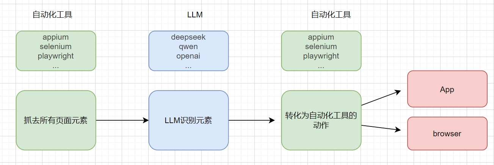
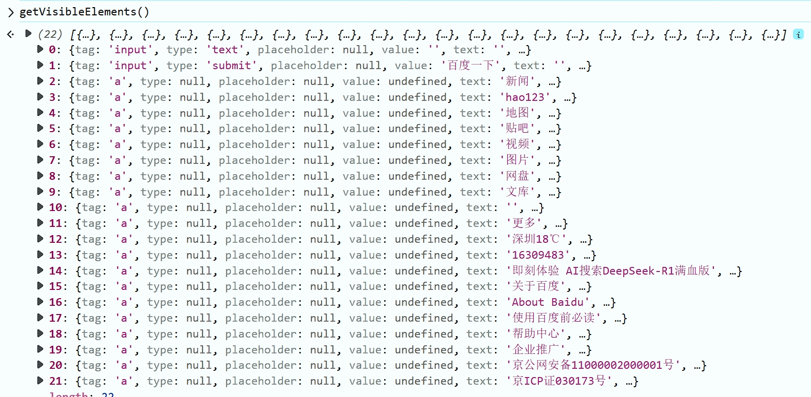

# auto-wing 实现原理 - 如何利用AI识别页面元素。

## auto-wing 介绍

...

## 工作原理

* __流程图__




## 实现过程

### 1. 抓取当前页面所有元素

```js
const getVisibleElements = () => {
    const elements = [];
    const selectors = [
        'input', 'button', 'a', '[role="button"]',
        '[role="link"]', '[role="searchbox"]', 'textarea'
    ];
    
    for (const selector of selectors) {
        document.querySelectorAll(selector).forEach(el => {
            if (el.offsetWidth > 0 && el.offsetHeight > 0) {
                elements.push({
                    tag: el.tagName.toLowerCase(),
                    type: el.getAttribute('type'),
                    placeholder: el.getAttribute('placeholder'),
                    value: el.value,
                    text: el.textContent?.trim(),
                    aria: el.getAttribute('aria-label'),
                    id: el.id,
                    name: el.getAttribute('name'),
                    class: el.className
                });
            }
        });
    }
    return elements;
};
```

获取当前页面的元素信息：




### 2.根据描述分析元素定位和动作

__2.1 大模型的调用__

* openai SDK(推荐)

```python
import os
from openai import OpenAI

client = OpenAI(
    # 若没有配置环境变量，请用百炼API Key将下行替换为：api_key="sk-xxx",
    api_key=os.getenv("DASHSCOPE_API_KEY"), 
    base_url="https://dashscope.aliyuncs.com/compatible-mode/v1",
)
completion = client.chat.completions.create(
    model="qwen-plus", # 此处以qwen-plus为例，可按需更换模型名称。模型列表：https://help.aliyun.com/zh/model-studio/getting-started/models
    messages=[
        {'role': 'system', 'content': 'You are a helpful assistant.'},
        {'role': 'user', 'content': '你是谁？'}],
    )
    
print(completion.model_dump_json())
```

* Request调用

```python
import requests
import os

# 设置 API 密钥
DASHSCOPE_API_KEY = os.getenv("DASHSCOPE_API_KEY")  # 从环境变量中获取 API 密钥

# 请求的 URL
url = "https://dashscope.aliyuncs.com/compatible-mode/v1/chat/completions"

# 请求头
headers = {
    "Authorization": f"Bearer {DASHSCOPE_API_KEY}",
    "Content-Type": "application/json"
}

# 请求体
data = {
    "model": "qwen-plus",
    "messages": [
        {
            "role": "system",
            "content": "You are a helpful assistant."
        },
        {
            "role": "user",
            "content": "你是谁？"
        }
    ]
}

# 发送 POST 请求
response = requests.post(url, headers=headers, json=data)

# 打印响应结果
print(response.status_code)
print(response.json())
```

__2.2 提示词__

```python

action_prompt= """You are a web automation assistant. Based on the following page context, provide instructions for the requested action.

Current page context:
URL: {context['url']}
Title: {context['title']}

Available elements:
{json.dumps(context['elements'], indent=2)}

User request: {prompt}

Return ONLY a JSON object with the following structure, no other text:
{{
    "selector": "CSS selector or XPath to locate the element",
    "action": "fill",
    "value": "text to input",
    "key": "key to press if needed"
}}

Example response:
{{
    "selector": "#search-input",
    "action": "fill",
    "value": "search text",
    "key": "Enter"
}}
"""

```

识别并返回的数据：

```json
{
    "selector": "#sb_form_q",
    "action": "fill",
    "value": "playwright",
    "key": "Enter"
}
```

### 3. 根据返回，转化动作。

转化为自动化工具的动作执行：

```python
    ...
    element = self.page.locator(selector)
    if action == 'click':
        element.click()
    elif action == 'fill':
        element.fill(instruction.get('value', ''))
        if instruction.get('key'):
            element.press(instruction.get('key'))
    elif action == 'press':
        element.press(instruction.get('key', 'Enter'))
    else:
        raise ValueError(f"Unsupported action: {action}")
```

## 代码设计

1. 如何支持更多的模型。
2. 如何支持多个测试库。
3. App测试有哪些不同。
4. 更多的基于AI的功能探索和尝试。
